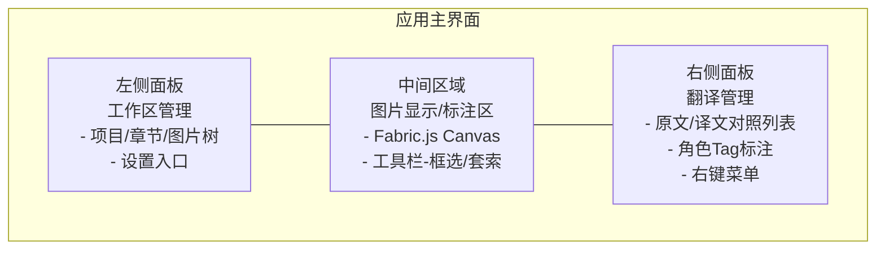
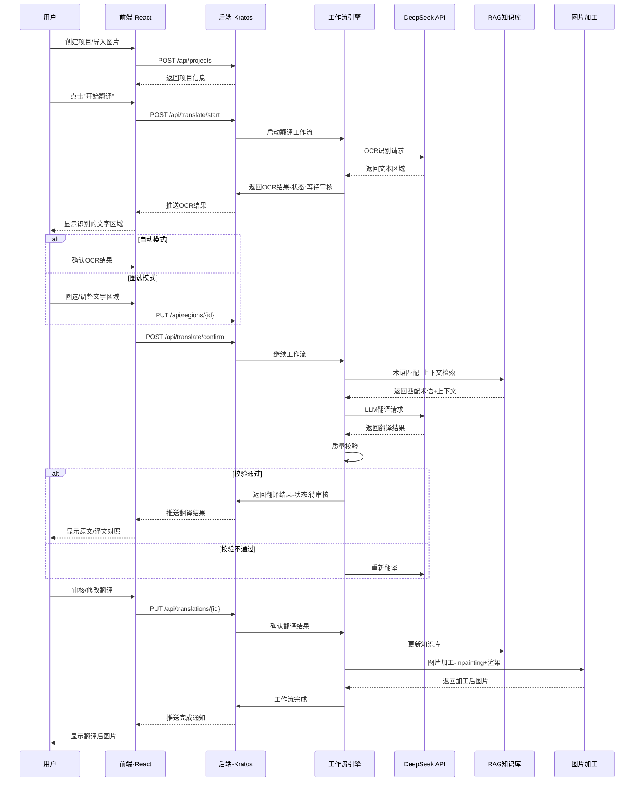
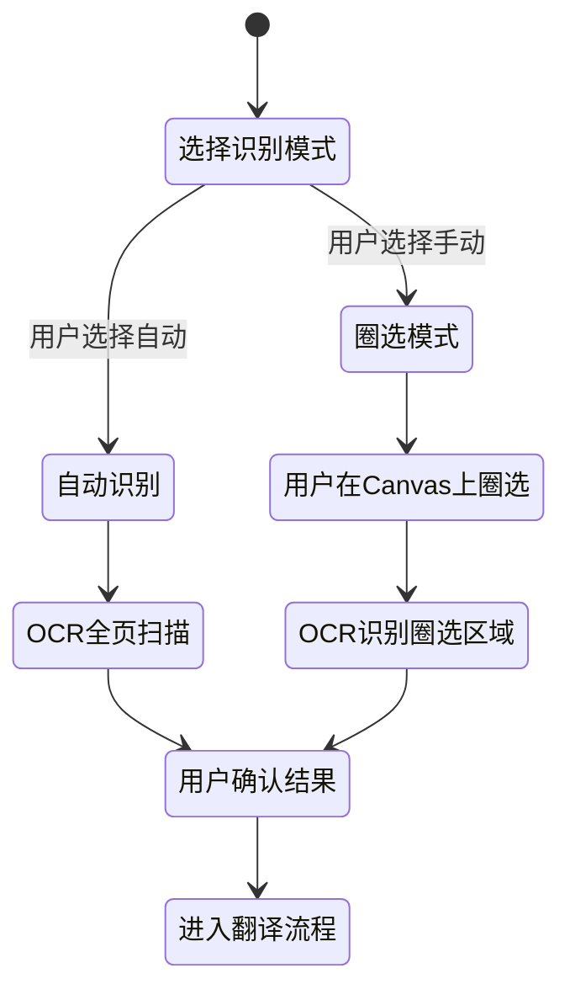
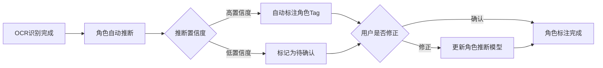
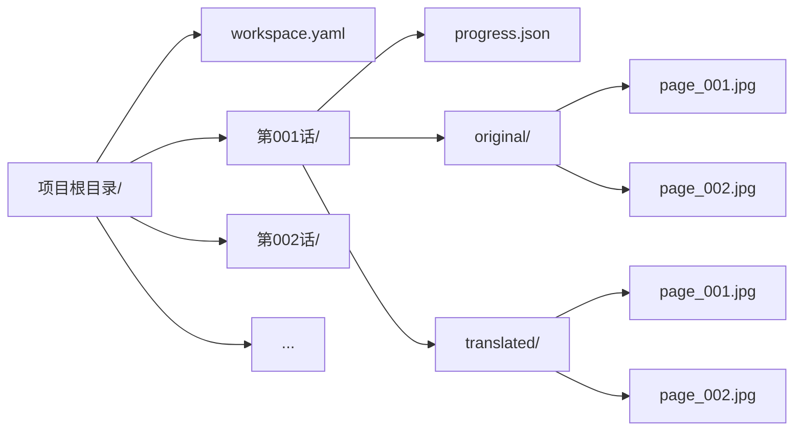

# 产品交互方案

## 界面布局设计

应用采用经典三栏布局，左侧为工作区管理面板，中间为图片显示/标注区，右侧为翻译管理面板，左下角设有设置面板入口。



### 面板详细说明

| 面板 | 位置 | 功能 |
|------|------|------|
| 工作区管理面板 | 左侧 | 项目/章节/图片树形导航，文件拖拽导入，设置入口 |
| 图片显示/标注区 | 中间 | Fabric.js Canvas 渲染原图，文字区域框选/套索/拖拽/缩放，缩放平移 |
| 翻译管理面板 | 右侧 | 原文/译文对照列表，角色Tag标注，翻译状态标记，右键菜单 |
| 设置面板 | 左下角 | 术语库设置、API配置、偏好设置 |

## 核心交互流程

以下时序图展示了用户从创建项目到完成翻译的核心交互流程：



## 文本选择与识别模式

系统支持两种 OCR 识别模式，用户可在开始翻译时选择：

### 自动识别模式

- 工作流自动调用 OCR 识别整页所有文字区域
- 识别完成后进入用户确认环节，用户可删除误识别区域
- 适用于文字区域清晰、布局规则的漫画页面

### 圈选模式

- 用户在 Canvas 上手动框选或套索圈选文字区域
- 仅对圈选区域进行 OCR 识别
- 适用于文字区域不规则、背景复杂的漫画页面
- 支持在自动识别结果基础上追加/调整圈选区域



## 翻译处理交互

### 单条翻译

- 在翻译面板中，每条原文对应一行翻译结果
- 用户可点击某条翻译进行编辑修改
- 修改后点击确认按钮保存

### 批量翻译

- 用户可选择整页或整章进行批量翻译
- 系统按工作流自动逐条处理，完成后统一展示结果
- 用户可逐条审核或一键确认全部

### 编辑与确认

- 翻译结果支持行内编辑，直接修改译文文本
- 编辑后状态标记为"已修改"，区别于自动翻译结果
- 确认后的翻译不可再编辑（需撤回确认操作）
- 确认操作触发知识库更新和图片加工流程

### 翻译状态流转

| 状态 | 说明 |
|------|------|
| pending | 待翻译，工作流尚未处理 |
| translating | 翻译中，LLM 正在处理 |
| reviewing | 待审核，翻译完成等待用户确认 |
| modified | 已修改，用户手动编辑过译文 |
| confirmed | 已确认，用户确认翻译结果 |
| processing | 图片加工中 |
| completed | 已完成，成品图片已生成 |

## 术语库划选交互流程

用户可以在翻译过程中随时将原文中的术语添加到术语库，支持划选文字快速入库，一个源术语可对应多条目标语言翻译。

```mermaid
sequenceDiagram
    participant U as 用户
    participant FE as 前端-React
    participant BE as 后端-Kratos

    U->>FE: 在翻译面板原文上划选文字
    FE-->>U: 右键弹出菜单-"加入术语库"
    U->>FE: 点击"加入术语库"
    FE-->>U: 弹出术语编辑弹窗
    Note over U,FE: 弹窗内容：
- 源术语：只读，自动填入划选文字，标注源语言
- 目标翻译：默认显示项目目标语言输入行
- +按钮：动态添加更多目标语言翻译行
- 备注：可选填
    U->>FE: 填写目标翻译并确认
    FE->>BE: POST /api/glossary/entries
    BE-->>FE: 返回术语条目-GlossaryEntry + GlossaryTranslation
    FE-->>U: 提示"术语已添加"
```

### 术语编辑弹窗设计

| 字段 | 类型 | 说明 |
|------|------|------|
| 源术语 | 只读文本 | 自动填入划选文字 |
| 源语言 | 只读标签 | 自动识别，显示语言代码 |
| 目标翻译 | 输入框+语言选择 | 默认显示项目目标语言输入行，可点击"+"添加更多语言行 |
| 备注 | 可选文本 | 术语使用场景说明 |
| 作用域 | 单选 | 项目级 / 全局 |

## 右键菜单功能设计

### 翻译面板右键菜单

| 菜单项 | 触发条件 | 功能 |
|--------|----------|------|
| 加入术语库 | 划选原文文字 | 弹出术语编辑弹窗 |
| 重新翻译 | 点击某条翻译 | 重新调用 LLM 翻译该条 |
| 标记忽略 | 点击某条翻译 | 标记该区域忽略，不参与翻译 |
| 编辑角色 | 点击角色Tag | 弹出角色编辑弹窗 |
| 复制原文 | 点击原文 | 复制原文到剪贴板 |
| 复制译文 | 点击译文 | 复制译文到剪贴板 |

### Canvas 右键菜单

| 菜单项 | 触发条件 | 功能 |
|--------|----------|------|
| 添加文字区域 | 点击空白区域 | 在点击位置添加新的文字区域框 |
| 删除区域 | 点击已有区域 | 删除该文字区域 |
| 重新OCR | 点击已有区域 | 重新识别该区域文字 |
| 忽略区域 | 点击已有区域 | 标记该区域忽略 |

## 角色标注交互

### 自动推断 + 手动修正机制

1. **自动推断**：OCR 完成后，工作流自动调用角色推断节点，根据文字内容、位置、样式等特征推断角色归属
2. **推断结果展示**：翻译面板中每条原文旁显示角色Tag（自动推断结果以虚线框标识）
3. **手动修正**：用户可点击角色Tag，在弹出菜单中选择已有角色或创建新角色
4. **角色推断学习**：用户修正后的角色归属会反馈到角色推断模型，提升后续推断准确性



## 工作区文件组织结构

每个项目对应一个工作区目录，按章节（话）组织原始图片与翻译输出，翻译进度通过 progress.json 追踪。



### 文件/目录说明

| 文件/目录 | 说明 |
|-----------|------|
| `workspace.yaml` | 工作区配置（源语言/目标语言、API密钥引用、术语库路径等） |
| `第N话/progress.json` | 翻译进度（文本区域、翻译结果、状态标记） |
| `第N话/original/` | 原始图片目录 |
| `第N话/translated/` | 翻译后输出图片目录 |

## 配置文件设计

### workspace.yaml 示例

```yaml
# 工作区配置文件
project:
  name: "战锤漫画第一卷"
  source_lang: "ja"      # 源语言
  target_lang: "zh-CN"   # 目标语言

api:
  deepseek:
    api_key_ref: "DEEPSEEK_API_KEY"  # 环境变量引用
    model: "deepseek-chat"
  gpt_image:
    api_key_ref: "OPENAI_API_KEY"
    model: "gpt-image-2"

glossary:
  global_path: "./glossary/global.yaml"   # 全局术语库路径
  project_path: "./glossary/project.yaml" # 项目术语库路径

knowledge_base:
  character_profiles: true   # 启用角色风格档案
  style_rules: true          # 启用风格规则
  translation_examples: true # 启用翻译范例RAG
  glossary: true             # 启用术语匹配

output:
  format: "jpg"
  quality: 95
```

### 配置加载优先级

1. 默认值（代码内硬编码）
2. 全局配置文件（`~/.comic-translator/config.yaml`）
3. 工作区配置文件（`workspace.yaml`）
4. 环境变量覆盖

优先级从低到高，高优先级覆盖低优先级同名字段。
