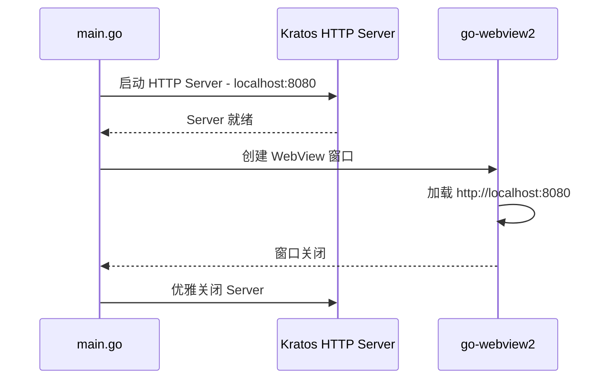

# 后端方案

## 技术选型

| 技术 | 说明 |
|------|------|
| Go 1.22+ | 主开发语言 |
| Kratos v2 | B站开源 Go 微服务框架，HTTP/gRPC 支持 |
| langgraphgo | Go 版 LangGraph，翻译工作流编排 |
| langchaingo | Go 版 LangChain，LLM Provider 适配 |
| modernc.org/sqlite | 纯 Go SQLite 驱动，无 CGO 依赖 |
| chromem-go | Go 原生向量数据库，嵌入式 |
| go-webview2 | Go 绑定 WebView2，桌面窗口 |
| YAML | 配置文件格式 |

## 项目结构

```
.
├── cmd/
│   └── server/
│       └── main.go              # 应用入口
├── internal/
│   ├── conf/                    # 配置定义
│   │   └── conf.proto           # 配置结构定义
│   ├── server/                  # HTTP Server
│   │   └── http.go              # Kratos HTTP Server 配置
│   ├── service/                 # 服务层-处理HTTP请求
│   │   ├── project.go
│   │   ├── translation.go
│   │   ├── glossary.go
│   │   ├── knowledge.go
│   │   └── image.go
│   ├── biz/                     # 业务逻辑层
│   │   ├── project.go
│   │   ├── translation.go
│   │   ├── glossary.go
│   │   ├── knowledge.go
│   │   ├── workflow.go
│   │   └── image.go
│   ├── data/                    # 数据访问层
│   │   ├── db.go                # 数据库初始化
│   │   ├── project.go
│   │   ├── translation.go
│   │   ├── glossary.go
│   │   ├── knowledge.go
│   │   └── migration/           # 数据库迁移
│   │       ├── 001_init.sql
│   │       └── 002_glossary.sql
│   └── workflow/                # 工作流引擎
│       ├── graph.go             # StateGraph 定义
│       ├── nodes.go             # 各节点实现
│       ├── state.go             # 工作流状态定义
│       └── checkpointer.go      # SQLite Checkpointer
├── pkg/                         # 可复用包
│   ├── llm/                     # LLM 适配层
│   │   ├── provider.go          # Provider 接口
│   │   ├── deepseek.go          # DeepSeek 实现
│   │   └── prompt.go            # Prompt 模板
│   ├── imageproc/               # 图片加工适配层
│   │   ├── provider.go          # Provider 接口
│   │   └── gptimage.go          # GPT-image-2 实现
│   ├── embedding/               # Embedding 服务
│   │   └── embedding.go
│   └── vectorstore/             # 向量存储
│       └── chromem.go           # chromem-go 封装
├── configs/                     # 配置文件
│   └── config.yaml              # 默认配置
├── web/                         # 前端项目（Vite + React）
│   └── dist/                    # 前端构建产物
├── go.mod
├── go.sum
└── Makefile
```

## HTTP Server 设计

### Kratos HTTP Server 配置

- 监听 `localhost:8080`
- 启用 CORS（开发环境允许 `localhost:5173`）
- 静态资源服务：`/` 路径服务前端 `dist/` 目录
- API 路径前缀：`/api/`
- 请求超时：30s（翻译类接口 120s）
- 请求体大小限制：50MB（图片上传）

### 路由注册

```go
// internal/server/http.go
func NewHTTPServer(c *conf.Server, ...) *kratoshttp.Server {
    srv := kratoshttp.NewServer(
        kratoshttp.Address(c.Http.Addr),
        kratoshttp.Timeout(30*time.Second),
    )
    // 静态资源
    srv.HandlePrefix("/", kratoshttp.FileServer(http.Dir("./web/dist")))
    // API 路由
    r := srv.Route("/api")
    // ... 注册各 service 路由
    return srv
}
```

## Service 层设计

Service 层负责 HTTP 请求解析和响应封装，调用 Biz 层处理业务逻辑。

### ProjectService

```go
type ProjectService interface {
    // ListProjects 获取项目列表
    ListProjects(ctx context.Context) ([]*Project, error)
    // CreateProject 创建项目
    CreateProject(ctx context.Context, req *CreateProjectReq) (*Project, error)
    // GetProject 获取项目详情
    GetProject(ctx context.Context, id int64) (*Project, error)
    // DeleteProject 删除项目
    DeleteProject(ctx context.Context, id int64) error
    // GetChapters 获取章节列表
    GetChapters(ctx context.Context, projectID int64) ([]*Chapter, error)
    // GetImages 获取图片列表
    GetImages(ctx context.Context, chapterID int64) ([]*Image, error)
}
```

### TranslationService

```go
type TranslationService interface {
    // StartTranslation 启动翻译工作流
    StartTranslation(ctx context.Context, req *StartTranslationReq) (*WorkflowRun, error)
    // ConfirmOCR 确认OCR结果
    ConfirmOCR(ctx context.Context, runID string, regions []TextRegion) error
    // GetTranslationStatus 获取翻译状态
    GetTranslationStatus(ctx context.Context, imageID int64) (*TranslationStatus, error)
    // EditTranslation 编辑翻译
    EditTranslation(ctx context.Context, id int64, text string) error
    // ConfirmTranslation 确认翻译
    ConfirmTranslation(ctx context.Context, id int64) error
    // Retranslate 重新翻译
    Retranslate(ctx context.Context, id int64) error
    // BatchConfirm 批量确认
    BatchConfirm(ctx context.Context, ids []int64) error
}
```

### GlossaryService

```go
type GlossaryService interface {
    // ListEntries 获取术语条目列表
    ListEntries(ctx context.Context, projectID int64, scope string) ([]*GlossaryEntry, error)
    // CreateEntry 创建术语条目
    CreateEntry(ctx context.Context, req *CreateGlossaryReq) (*GlossaryEntry, error)
    // UpdateEntry 更新术语条目
    UpdateEntry(ctx context.Context, id int64, req *UpdateGlossaryReq) error
    // DeleteEntry 删除术语条目
    DeleteEntry(ctx context.Context, id int64) error
}
```

### KnowledgeService

```go
type KnowledgeService interface {
    // 角色管理
    ListCharacters(ctx context.Context, projectID int64) ([]*CharacterProfile, error)
    CreateCharacter(ctx context.Context, req *CreateCharacterReq) (*CharacterProfile, error)
    UpdateCharacter(ctx context.Context, id int64, req *UpdateCharacterReq) error
    DeleteCharacter(ctx context.Context, id int64) error

    // 风格规则
    ListStyleRules(ctx context.Context, projectID int64, scope string) ([]*StyleRule, error)
    CreateStyleRule(ctx context.Context, req *CreateStyleRuleReq) (*StyleRule, error)
    UpdateStyleRule(ctx context.Context, id int64, req *UpdateStyleRuleReq) error
    DeleteStyleRule(ctx context.Context, id int64) error

    // 翻译范例
    ListTranslationExamples(ctx context.Context, characterID int64) ([]*TranslationExample, error)
    CreateTranslationExample(ctx context.Context, req *CreateExampleReq) (*TranslationExample, error)
}
```

### ImageService

```go
type ImageService interface {
    // ProcessImage 图片加工
    ProcessImage(ctx context.Context, req *ProcessImageReq) (*ProcessImageResp, error)
    // GetProcessStatus 获取加工状态
    GetProcessStatus(ctx context.Context, taskID string) (*ProcessStatus, error)
}
```

## Biz 层设计

Biz 层包含核心业务逻辑，被 Service 层调用，依赖 Data 层获取数据。

### ProjectBiz

- 项目创建：创建目录结构 + 数据库记录 + workspace.yaml
- 项目删除：级联删除数据库记录 + 可选删除文件
- 目录映射：将文件系统目录结构映射到数据模型

### TranslationBiz

- 翻译启动：初始化工作流 StateGraph，配置节点和边
- 翻译确认：触发知识库更新 + 图片加工流程
- 质量校验：调用质量校验引擎评估翻译质量

### GlossaryBiz

- 术语 CRUD：基础增删改查
- 多语言管理：GlossaryEntry + GlossaryTranslation 联合操作
- 作用域逻辑：全局术语 vs 项目术语，优先级合并

### KnowledgeBiz

- 角色推断：调用角色推断算法，返回候选角色及置信度
- 知识库组装：按四层结构逐层查询，组装 Prompt 上下文
- RAG 检索：基于 embedding 检索相似翻译范例

### WorkflowBiz

- StateGraph 编排：定义节点、边、条件路由
- HITL 中断：在指定节点设置中断点，等待用户输入
- 状态恢复：从 Checkpointer 加载状态，从断点续跑

### ImageBiz

- Inpainting 调用：封装 GPT-image-2 API
- 文字渲染：在擦除区域渲染翻译文字
- 图片合成：将渲染结果合成到原图

## Data 层设计

Data 层定义 Repository 接口，封装数据库操作。

### Repository 接口

```go
type ProjectRepo interface {
    List(ctx context.Context) ([]*Project, error)
    Get(ctx context.Context, id int64) (*Project, error)
    Create(ctx context.Context, p *Project) (*Project, error)
    Delete(ctx context.Context, id int64) error
}

type ChapterRepo interface {
    ListByProject(ctx context.Context, projectID int64) ([]*Chapter, error)
    Create(ctx context.Context, c *Chapter) (*Chapter, error)
    Delete(ctx context.Context, id int64) error
}

type ImageRepo interface {
    ListByChapter(ctx context.Context, chapterID int64) ([]*Image, error)
    Get(ctx context.Context, id int64) (*Image, error)
    Create(ctx context.Context, img *Image) (*Image, error)
    Update(ctx context.Context, img *Image) error
    Delete(ctx context.Context, id int64) error
}

type TextRegionRepo interface {
    ListByImage(ctx context.Context, imageID int64) ([]*TextRegion, error)
    Create(ctx context.Context, r *TextRegion) (*TextRegion, error)
    Update(ctx context.Context, r *TextRegion) error
    Delete(ctx context.Context, id int64) error
    BatchCreate(ctx context.Context, regions []*TextRegion) error
}

type TranslationRepo interface {
    GetByRegion(ctx context.Context, regionID int64) (*Translation, error)
    Create(ctx context.Context, t *Translation) (*Translation, error)
    Update(ctx context.Context, t *Translation) error
    BatchUpdate(ctx context.Context, translations []*Translation) error
}

type GlossaryRepo interface {
    ListEntries(ctx context.Context, projectID int64, isGlobal bool) ([]*GlossaryEntry, error)
    GetEntry(ctx context.Context, id int64) (*GlossaryEntry, error)
    CreateEntry(ctx context.Context, e *GlossaryEntry) (*GlossaryEntry, error)
    UpdateEntry(ctx context.Context, e *GlossaryEntry) error
    DeleteEntry(ctx context.Context, id int64) error
    ListTranslations(ctx context.Context, entryID int64) ([]*GlossaryTranslation, error)
    CreateTranslation(ctx context.Context, t *GlossaryTranslation) (*GlossaryTranslation, error)
}

type CharacterRepo interface {
    ListByProject(ctx context.Context, projectID int64) ([]*CharacterProfile, error)
    Get(ctx context.Context, id int64) (*CharacterProfile, error)
    Create(ctx context.Context, c *CharacterProfile) (*CharacterProfile, error)
    Update(ctx context.Context, c *CharacterProfile) error
    Delete(ctx context.Context, id int64) error
}

type StyleRuleRepo interface {
    ListByProject(ctx context.Context, projectID int64, scope string) ([]*StyleRule, error)
    Create(ctx context.Context, r *StyleRule) (*StyleRule, error)
    Update(ctx context.Context, r *StyleRule) error
    Delete(ctx context.Context, id int64) error
}

type TranslationExampleRepo interface {
    ListByCharacter(ctx context.Context, characterID int64) ([]*TranslationExample, error)
    Create(ctx context.Context, e *TranslationExample) (*TranslationExample, error)
    Delete(ctx context.Context, id int64) error
}
```

## 配置管理

### 配置结构

```yaml
# configs/config.yaml
server:
  http:
    addr: "0.0.0.0:8080"
    timeout: 30s

database:
  driver: "sqlite"
  dsn: "./data/comic-translator.db"

vectorstore:
  type: "chromem"
  path: "./data/chromem"

llm:
  provider: "deepseek"
  api_key_env: "DEEPSEEK_API_KEY"
  model: "deepseek-chat"
  base_url: "https://api.deepseek.com"

image_processing:
  provider: "gpt-image-2"
  api_key_env: "OPENAI_API_KEY"
  model: "gpt-image-2"

logging:
  level: "info"
  format: "json"
```

### 配置加载流程

1. 加载默认值（代码内）
2. 加载全局配置（`~/.comic-translator/config.yaml`，可选）
3. 加载工作区配置（`workspace.yaml`，可选）
4. 环境变量覆盖（`COMIC_TRANSLATOR_` 前缀）

使用 `mergo` 库进行配置合并，高优先级覆盖低优先级。

## webview 桌面壳集成

### 启动流程



### 集成要点

- main.go 中先启动 Kratos HTTP Server，再创建 WebView 窗口
- WebView 窗口关闭时触发 Server 优雅关闭
- 窗口标题栏使用原生样式，内容区全屏加载前端
- 开发模式下可禁用 WebView，直接浏览器访问

## API 接口列表

### 项目管理

| 方法 | 路径 | 说明 |
|------|------|------|
| GET | /api/projects | 获取项目列表 |
| POST | /api/projects | 创建项目 |
| GET | /api/projects/:id | 获取项目详情 |
| DELETE | /api/projects/:id | 删除项目 |
| GET | /api/projects/:id/chapters | 获取章节列表 |
| GET | /api/chapters/:id/images | 获取图片列表 |

### 翻译工作流

| 方法 | 路径 | 说明 |
|------|------|------|
| POST | /api/translate/start | 启动翻译工作流 |
| POST | /api/translate/:runId/confirm-ocr | 确认OCR结果 |
| GET | /api/images/:id/translations | 获取图片翻译结果 |
| PUT | /api/translations/:id | 编辑翻译 |
| POST | /api/translations/:id/confirm | 确认翻译 |
| POST | /api/translations/:id/retranslate | 重新翻译 |
| POST | /api/translations/batch-confirm | 批量确认 |

### 术语库

| 方法 | 路径 | 说明 |
|------|------|------|
| GET | /api/projects/:id/glossary | 获取术语列表 |
| POST | /api/glossary/entries | 创建术语条目 |
| PUT | /api/glossary/entries/:id | 更新术语条目 |
| DELETE | /api/glossary/entries/:id | 删除术语条目 |

### 知识库

| 方法 | 路径 | 说明 |
|------|------|------|
| GET | /api/projects/:id/characters | 获取角色列表 |
| POST | /api/projects/:id/characters | 创建角色 |
| PUT | /api/characters/:id | 更新角色 |
| DELETE | /api/characters/:id | 删除角色 |
| GET | /api/projects/:id/style-rules | 获取风格规则 |
| POST | /api/projects/:id/style-rules | 创建风格规则 |
| PUT | /api/style-rules/:id | 更新风格规则 |
| DELETE | /api/style-rules/:id | 删除风格规则 |
| GET | /api/characters/:id/examples | 获取翻译范例 |
| POST | /api/characters/:id/examples | 创建翻译范例 |

### 图片加工

| 方法 | 路径 | 说明 |
|------|------|------|
| POST | /api/images/:id/process | 触发图片加工 |
| GET | /api/image-tasks/:taskId | 获取加工状态 |

## 打包部署方案

### go:embed 嵌入前端

```go
//go:embed web/dist
var webDist embed.FS

// Kratos HTTP Server 使用 embed.FS 提供静态资源
srv.HandlePrefix("/", kratoshttp.FileServer(http.FS(webDist)))
```

### 单文件可执行打包

1. 前端构建：`pnpm build` → 生成 `web/dist/`
2. 后端构建：`go build -o comic-translator.exe ./cmd/server/`
3. 前端资源通过 `go:embed` 嵌入可执行文件
4. 最终交付：单个 `comic-translator.exe` + 默认配置文件

### 打包命令

```makefile
build:
    cd web && pnpm build
    go build -ldflags="-s -w" -o comic-translator.exe ./cmd/server/
```

### 运行时依赖

- WebView2 Runtime（Windows 10/11 默认安装）
- 无其他外部依赖
- SQLite 数据库自动创建
- chromem-go 向量库自动初始化
