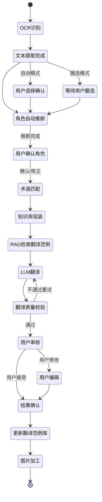
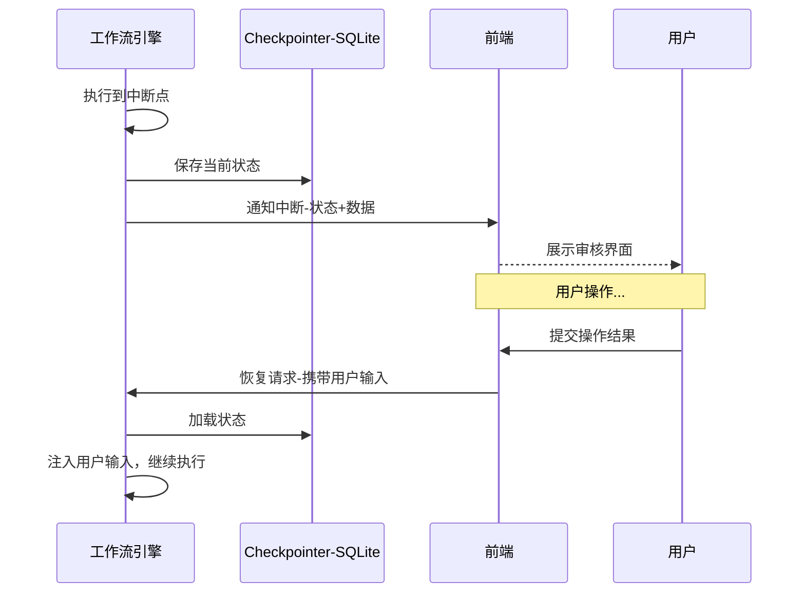
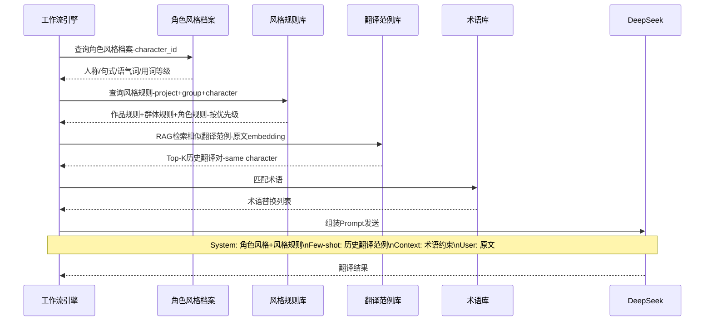

# Agent 模型/工作流方案

## 技术选型

| 技术 | 说明 |
|------|------|
| langgraphgo | Go 版 LangGraph，翻译工作流状态图编排 |
| langchaingo | Go 版 LangChain，统一 LLM Provider 接口 |
| DeepSeek API | 翻译/OCR 使用的 LLM |
| GPT-image-2 API | 图片 Inpainting 加工 |
| chromem-go | RAG 向量检索 |

## StateGraph 设计

### 节点定义

| 节点 | 类型 | 说明 |
|------|------|------|
| ocr_node | 自动 | OCR 识别图片中的文字区域 |
| character_infer_node | 自动 | 根据文字内容推断角色归属 |
| confirm_regions_node | HITL | 用户确认/调整文字区域（中断点） |
| confirm_character_node | HITL | 用户确认/修正角色标注（中断点） |
| glossary_match_node | 自动 | 术语匹配，标注原文中的术语 |
| knowledge_assemble_node | 自动 | 逐层组装知识库上下文 |
| rag_retrieve_node | 自动 | RAG 检索相似翻译范例 |
| llm_translate_node | 自动 | 调用 LLM 翻译 |
| quality_check_node | 自动 | 翻译质量校验 |
| review_translation_node | HITL | 用户审核翻译结果（中断点） |
| update_knowledge_node | 自动 | 更新翻译范例库 |
| image_process_node | 自动 | 图片加工（Inpainting + 文字渲染） |

### 边定义

| 起始节点 | 目标节点 | 条件 |
|----------|----------|------|
| START | ocr_node | - |
| ocr_node | confirm_regions_node | OCR 完成 |
| confirm_regions_node | character_infer_node | 用户确认区域 |
| character_infer_node | confirm_character_node | 推断完成 |
| confirm_character_node | glossary_match_node | 用户确认角色 |
| glossary_match_node | knowledge_assemble_node | 术语匹配完成 |
| knowledge_assemble_node | rag_retrieve_node | 上下文组装完成 |
| rag_retrieve_node | llm_translate_node | 范例检索完成 |
| llm_translate_node | quality_check_node | 翻译完成 |
| quality_check_node | review_translation_node | 校验通过 |
| quality_check_node | llm_translate_node | 校验不通过，重试 |
| review_translation_node | update_knowledge_node | 用户接受 |
| review_translation_node | llm_translate_node | 用户要求重新翻译 |
| update_knowledge_node | image_process_node | 知识库更新完成 |
| image_process_node | END | 图片加工完成 |

## 翻译工作流状态图



## 各节点详细设计

### OCR 识别节点

**功能**：调用 DeepSeek API 对图片进行 OCR，识别文字区域和文字内容。

**输入**：图片文件路径或 Base64

**输出**：TextRegion 列表（文字内容 + 坐标位置）

**处理逻辑**：
1. 读取图片文件，转为 Base64
2. 调用 DeepSeek Vision API，Prompt 指定输出文字及坐标
3. 解析 API 返回，提取文字区域列表
4. 对每个区域创建 TextRegion 记录，写入数据库

**错误处理**：
- API 调用失败：重试 3 次，间隔递增（1s, 3s, 5s）
- 返回格式异常：记录错误日志，跳过该区域

### 角色自动推断节点

**功能**：根据 OCR 识别的文字内容、位置、样式等特征，推断每段文字对应的角色。

**输入**：TextRegion 列表 + 项目已有角色列表

**输出**：每个 TextRegion 的角色推断结果（角色ID + 置信度）

**推断策略**：
1. **关键词匹配**：检查文字中是否包含已知角色的口头禅/语气词
2. **位置推断**：漫画中气泡位置与角色的空间关系
3. **上下文推断**：前后文对话的角色轮换规律
4. **LLM 辅助推断**：对低置信度区域调用 LLM 进行角色推断

**置信度阈值**：
- 高置信度（>0.8）：自动标注
- 中置信度（0.5-0.8）：标注但标记为待确认
- 低置信度（<0.5）：标记为未知角色

### 术语匹配节点

**功能**：在原文中匹配术语库中的术语，标注需强制翻译的条目。

**输入**：TextRegion 列表 + 术语库

**输出**：匹配结果列表（原文位置 → 术语条目 → 目标语言翻译）

**匹配算法**：
1. 全局术语匹配：检查所有全局术语
2. 项目术语匹配：检查项目级术语
3. 模糊匹配：使用编辑距离/Levenshtein 处理变体
4. 优先级：项目级 > 全局级；精确匹配 > 模糊匹配

### 知识库组装节点

**功能**：按四层结构逐层查询知识库，组装翻译 Prompt 上下文。

**输入**：角色ID + 项目ID + 源语言/目标语言

**输出**：组装好的 Prompt 上下文（系统提示 + 风格规则 + 范例 + 术语约束）

**处理流程**：
1. 加载角色风格档案（人称代词、句式、语气词等）
2. 加载风格规则（作品级 + 群体级 + 角色级，按优先级合并）
3. 加载术语匹配结果
4. 将以上内容组装为 System Prompt 和 Context

### RAG 检索翻译范例节点

**功能**：基于原文 embedding 在翻译范例库中检索相似历史翻译对，作为 Few-shot 示例。

**输入**：原文文本 + 角色ID

**输出**：Top-K 相似翻译范例列表

**处理流程**：
1. 对原文文本生成 embedding 向量
2. 在 chromem-go 中按角色分组检索
3. 按相似度排序，取 Top-K（默认 K=5）
4. 将检索结果格式化为 Few-shot 示例

**检索参数**：

| 参数 | 默认值 | 说明 |
|------|--------|------|
| top_k | 5 | 返回的最大范例数 |
| similarity_threshold | 0.7 | 最低相似度阈值 |
| character_filter | true | 是否按角色过滤 |

### LLM 翻译节点

**功能**：调用 LLM 进行翻译，注入知识库上下文和 Few-shot 范例。

**输入**：原文 + Prompt 上下文 + 术语约束 + Few-shot 范例

**输出**：翻译结果文本

**Prompt 组装结构**：

```
System Prompt:
  - 角色风格档案描述
  - 风格规则约束
  - 术语翻译对照表

Few-shot Examples:
  - 历史翻译范例（同角色）

Context:
  - 前后文原文（如果有）
  
User:
  - 待翻译原文
```

**LLM 调用参数**：

| 参数 | 默认值 | 说明 |
|------|--------|------|
| temperature | 0.3 | 低温度保证翻译一致性 |
| max_tokens | 1024 | 单条翻译最大 token |
| top_p | 0.9 | 核采样参数 |

### 质量校验节点

**功能**：对 LLM 翻译结果进行质量评估，决定是否需要重试。

**校验维度**：

| 维度 | 说明 | 校验方式 |
|------|------|----------|
| 术语一致性 | 术语库中的术语是否正确翻译 | 规则匹配检查 |
| 完整性 | 原文内容是否全部翻译 | 长度/关键词比对 |
| 角色风格 | 译文是否符合角色风格档案 | 规则 + LLM 评估 |
| 格式正确性 | 翻译结果是否包含异常字符 | 规则检查 |

**重试策略**：
- 最多重试 3 次
- 每次重试在 Prompt 中附加前次翻译及问题说明
- 3 次重试仍不通过则降低质量要求，标记为待人工审核

### 图片加工节点

**功能**：对原图进行 Inpainting 擦除原文字，渲染翻译文字，合成最终图片。

**处理流程**：
1. 根据文字区域坐标生成 Inpainting Mask
2. 调用 GPT-image-2 API 擦除原文字区域
3. 在擦除区域渲染翻译文字（字体、大小、颜色适配）
4. 合成最终图片，保存到 translated/ 目录

**详细设计**：
- Mask 生成：基于 TextRegion 的 region_coords 扩展 2px 边距
- 字体选择：根据目标语言选择 CJK 字体，支持粗体/斜体
- 文字对齐：根据区域大小自动调整字号，居中对齐
- 溢出检测：翻译文字超过区域大小时自动缩小字号或换行

## Human-in-the-Loop 中断/恢复机制

### 中断点设计

工作流在以下节点设置中断点（Interrupt Before），暂停等待用户输入：

| 中断点 | 触发条件 | 用户操作 |
|--------|----------|----------|
| confirm_regions_node | OCR 完成 | 确认/调整/删除文字区域 |
| confirm_character_node | 角色推断完成 | 确认/修正角色标注 |
| review_translation_node | 翻译完成 | 审核/修改/重新翻译 |

### 恢复机制

1. 工作流在中断点暂停，将当前状态保存到 Checkpointer
2. 前端通过 API 获取中断状态，展示给用户
3. 用户操作后，前端发送恢复请求（携带用户输入）
4. 工作流从断点恢复执行，将用户输入注入状态



## SQLite Checkpointer 持久化

### 持久化内容

| 字段 | 类型 | 说明 |
|------|------|------|
| run_id | TEXT | 工作流运行唯一标识 |
| thread_id | TEXT | 线程标识（同一图片的多次运行） |
| node_name | TEXT | 当前节点名称 |
| state | BLOB | 序列化的工作流状态 |
| created_at | DATETIME | 创建时间 |
| updated_at | DATETIME | 更新时间 |

### 存储策略

- 每次中断点自动保存
- 每次节点执行完成后保存增量
- 工作流完成后保留最终状态（用于历史查询）
- 定期清理超过 30 天的历史记录

## LLM 适配层设计

### 统一 Provider 接口

```go
type LLMProvider interface {
    // Translate 翻译文本
    Translate(ctx context.Context, req *TranslateRequest) (*TranslateResponse, error)
    // OCR 识别图片中的文字
    OCR(ctx context.Context, req *OCRRequest) (*OCRResponse, error)
    // InferCharacter 推断角色
    InferCharacter(ctx context.Context, req *InferRequest) (*InferResponse, error)
    // GenerateEmbedding 生成文本 embedding
    GenerateEmbedding(ctx context.Context, text string) ([]float32, error)
}

type TranslateRequest struct {
    SystemPrompt string
    FewShots     []FewShotExample
    Context      string
    SourceText   string
    Temperature  float32
    MaxTokens    int
}

type TranslateResponse struct {
    TranslatedText string
    TokenUsage     TokenUsage
}
```

### DeepSeek 实现

```go
type DeepSeekProvider struct {
    apiKey  string
    model   string
    baseURL string
    client  *http.Client
}
```

- 基于 langchaingo 的 DeepSeek 适配
- 支持流式和非流式响应
- 内置重试和超时机制
- API Key 从环境变量或配置文件读取

### 扩展性设计

- 可轻松添加新的 LLM Provider（如 OpenAI、Claude 等）
- 只需实现 `LLMProvider` 接口
- 通过配置文件切换 Provider

## 图片加工 API 适配层

### Provider 接口

```go
type ImageProcessProvider interface {
    // Inpainting 图片修复-擦除指定区域
    Inpainting(ctx context.Context, req *InpaintRequest) (*InpaintResponse, error)
    // RenderText 在指定区域渲染文字
    RenderText(ctx context.Context, req *RenderTextRequest) (*RenderTextResponse, error)
}

type InpaintRequest struct {
    ImageData []byte   // 原图数据
    MaskData  []byte   // Mask 数据-待擦除区域
    Regions   []Region // 区域坐标列表
}

type RenderTextRequest struct {
    ImageData []byte
    Region    Region
    Text      string
    FontSize  int
    FontColor string
}
```

### GPT-image-2 实现

```go
type GPTImageProvider struct {
    apiKey  string
    model   string
    baseURL string
    client  *http.Client
}
```

- 调用 OpenAI GPT-image-2 API 进行 Inpainting
- 支持自定义 Mask 区域
- 文字渲染使用本地 Go 图片处理库（如 gg 库）
- API 调用失败时重试 3 次

## Prompt 组装流程

翻译时，工作流引擎逐层查询知识库，按优先级组装 Prompt 上下文发送给 LLM。



### Prompt 模板示例

```
[System]
你是一位专业的漫画翻译专家。请将以下{source_lang}文本翻译为{target_lang}。

角色风格要求：
- 角色名：{character_name}
- 人称代词：{pronoun_preference}
- 句式特点：{sentence_style}
- 语气词：{tone_words}
- 口头禅：{catchphrase}
- 用词等级：{vocab_level}

风格规则：
{style_rules}

术语约束（必须使用指定翻译）：
{glossary_constraints}

[Few-shot Examples]
{few_shot_examples}

[Translation Task]
原文：{source_text}
```
