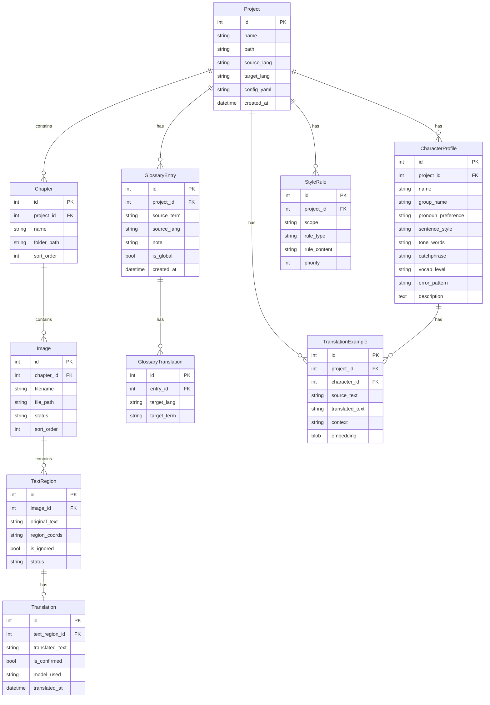

# 数据库结构方案

## 技术选型

| 技术 | 说明 |
|------|------|
| SQLite | 关系型数据存储，modernc.org/sqlite 纯 Go 实现，无 CGO 依赖 |
| chromem-go | 向量数据存储，Go 原生嵌入式向量数据库，无外部依赖 |

### 选型理由

- **SQLite (modernc.org/sqlite)**：纯 Go 实现，无需 CGO，交叉编译友好；嵌入式零部署，适合桌面应用场景；单文件数据库，备份和迁移简单
- **chromem-go**：Go 原生实现，无外部依赖；嵌入式向量数据库，与 SQLite 同理适合桌面应用；支持余弦相似度检索，满足 RAG 需求

## 完整 ER 图



## 各表详细设计

### projects 表

项目主表，每个翻译项目对应一条记录。

| 字段 | 类型 | 约束 | 说明 |
|------|------|------|------|
| id | INTEGER | PK, AUTOINCREMENT | 主键 |
| name | TEXT | NOT NULL | 项目名称 |
| path | TEXT | NOT NULL, UNIQUE | 项目工作区目录路径 |
| source_lang | TEXT | NOT NULL, DEFAULT 'ja' | 源语言代码 |
| target_lang | TEXT | NOT NULL, DEFAULT 'zh-CN' | 目标语言代码 |
| config_yaml | TEXT | | YAML 格式项目配置 |
| created_at | DATETIME | NOT NULL, DEFAULT CURRENT_TIMESTAMP | 创建时间 |
| updated_at | DATETIME | NOT NULL, DEFAULT CURRENT_TIMESTAMP | 更新时间 |

### chapters 表

章节表，按漫画"话"组织。

| 字段 | 类型 | 约束 | 说明 |
|------|------|------|------|
| id | INTEGER | PK, AUTOINCREMENT | 主键 |
| project_id | INTEGER | FK → projects.id, NOT NULL | 所属项目 |
| name | TEXT | NOT NULL | 章节名称，如"第001话" |
| folder_path | TEXT | NOT NULL | 章节目录路径 |
| sort_order | INTEGER | NOT NULL, DEFAULT 0 | 排序序号 |
| created_at | DATETIME | NOT NULL, DEFAULT CURRENT_TIMESTAMP | 创建时间 |

### images 表

图片表，每张漫画页面对应一条记录。

| 字段 | 类型 | 约束 | 说明 |
|------|------|------|------|
| id | INTEGER | PK, AUTOINCREMENT | 主键 |
| chapter_id | INTEGER | FK → chapters.id, NOT NULL | 所属章节 |
| filename | TEXT | NOT NULL | 文件名 |
| file_path | TEXT | NOT NULL | 文件完整路径 |
| status | TEXT | NOT NULL, DEFAULT 'pending' | 翻译状态：pending/translating/completed |
| sort_order | INTEGER | NOT NULL, DEFAULT 0 | 排序序号 |
| created_at | DATETIME | NOT NULL, DEFAULT CURRENT_TIMESTAMP | 创建时间 |
| updated_at | DATETIME | NOT NULL, DEFAULT CURRENT_TIMESTAMP | 更新时间 |

### text_regions 表

文字区域表，OCR 识别的每个文字区域。

| 字段 | 类型 | 约束 | 说明 |
|------|------|------|------|
| id | INTEGER | PK, AUTOINCREMENT | 主键 |
| image_id | INTEGER | FK → images.id, NOT NULL | 所属图片 |
| original_text | TEXT | | 识别的原文文本 |
| region_coords | TEXT | NOT NULL | 区域坐标 JSON，格式：`{x, y, w, h}` 或多边形坐标 |
| is_ignored | BOOLEAN | NOT NULL, DEFAULT 0 | 是否忽略该区域 |
| character_id | INTEGER | FK → character_profiles.id, NULLABLE | 关联角色 |
| character_confidence | REAL | DEFAULT 0 | 角色推断置信度 |
| status | TEXT | NOT NULL, DEFAULT 'pending' | 状态：pending/confirmed/ignored |
| created_at | DATETIME | NOT NULL, DEFAULT CURRENT_TIMESTAMP | 创建时间 |
| updated_at | DATETIME | NOT NULL, DEFAULT CURRENT_TIMESTAMP | 更新时间 |

### translations 表

翻译结果表，每个文字区域最多一条翻译。

| 字段 | 类型 | 约束 | 说明 |
|------|------|------|------|
| id | INTEGER | PK, AUTOINCREMENT | 主键 |
| text_region_id | INTEGER | FK → text_regions.id, NOT NULL, UNIQUE | 关联文字区域 |
| translated_text | TEXT | | 翻译文本 |
| is_confirmed | BOOLEAN | NOT NULL, DEFAULT 0 | 用户是否确认 |
| is_modified | BOOLEAN | NOT NULL, DEFAULT 0 | 用户是否手动修改 |
| model_used | TEXT | | 使用的 LLM 模型名 |
| retry_count | INTEGER | DEFAULT 0 | 重试次数 |
| translated_at | DATETIME | NOT NULL, DEFAULT CURRENT_TIMESTAMP | 翻译时间 |
| updated_at | DATETIME | NOT NULL, DEFAULT CURRENT_TIMESTAMP | 更新时间 |

### glossary_entry 表

术语条目表，存储源术语信息。采用新的多语言结构，一个源术语可对应多条目标语言翻译。

| 字段 | 类型 | 约束 | 说明 |
|------|------|------|------|
| id | INTEGER | PK, AUTOINCREMENT | 主键 |
| project_id | INTEGER | FK → projects.id, NULLABLE | 所属项目（NULL 表示全局术语） |
| source_term | TEXT | NOT NULL | 源术语文本 |
| source_lang | TEXT | NOT NULL | 源语言代码 |
| note | TEXT | | 术语使用说明/备注 |
| is_global | BOOLEAN | NOT NULL, DEFAULT 0 | 是否为全局术语 |
| created_at | DATETIME | NOT NULL, DEFAULT CURRENT_TIMESTAMP | 创建时间 |
| updated_at | DATETIME | NOT NULL, DEFAULT CURRENT_TIMESTAMP | 更新时间 |

**约束**：`UNIQUE(project_id, source_term, source_lang)` — 同一项目内源术语不重复。

### glossary_translation 表

术语翻译表，存储每个术语条目的多语言翻译。

| 字段 | 类型 | 约束 | 说明 |
|------|------|------|------|
| id | INTEGER | PK, AUTOINCREMENT | 主键 |
| entry_id | INTEGER | FK → glossary_entry.id, NOT NULL | 关联术语条目 |
| target_lang | TEXT | NOT NULL | 目标语言代码 |
| target_term | TEXT | NOT NULL | 目标语言翻译文本 |

**约束**：`UNIQUE(entry_id, target_lang)` — 每个术语条目每种语言一条翻译。

### character_profiles 表

角色风格档案表，知识库第一层。

| 字段 | 类型 | 约束 | 说明 |
|------|------|------|------|
| id | INTEGER | PK, AUTOINCREMENT | 主键 |
| project_id | INTEGER | FK → projects.id, NOT NULL | 所属项目 |
| name | TEXT | NOT NULL | 角色名称 |
| group_name | TEXT | | 所属群体/种族/阵营 |
| pronoun_preference | TEXT | | 人称代词偏好，如"俺"/"老子"/"在下" |
| sentence_style | TEXT | | 句式特点，如"短句祈使句"/"长句优雅" |
| tone_words | TEXT | | 语气词，逗号分隔，如"嘿嘿,呐,哼" |
| catchphrase | TEXT | | 口头禅/标志性台词 |
| vocab_level | TEXT | | 用词等级：coarse/neutral/elegant |
| error_pattern | TEXT | | 错误模式，如故意用错字模拟粗鲁 |
| description | TEXT | | 角色描述/备注 |
| created_at | DATETIME | NOT NULL, DEFAULT CURRENT_TIMESTAMP | 创建时间 |
| updated_at | DATETIME | NOT NULL, DEFAULT CURRENT_TIMESTAMP | 更新时间 |

### style_rules 表

风格规则表，知识库第二层。

| 字段 | 类型 | 约束 | 说明 |
|------|------|------|------|
| id | INTEGER | PK, AUTOINCREMENT | 主键 |
| project_id | INTEGER | FK → projects.id, NOT NULL | 所属项目 |
| scope | TEXT | NOT NULL | 作用域：project/group/character |
| target_id | INTEGER | | 作用目标ID（群体ID或角色ID，scope=project时为NULL） |
| rule_type | TEXT | NOT NULL | 规则类型：tone/vocab/format/other |
| rule_content | TEXT | NOT NULL | 规则内容 |
| priority | INTEGER | NOT NULL, DEFAULT 0 | 优先级，数值越大优先级越高 |
| created_at | DATETIME | NOT NULL, DEFAULT CURRENT_TIMESTAMP | 创建时间 |
| updated_at | DATETIME | NOT NULL, DEFAULT CURRENT_TIMESTAMP | 更新时间 |

### translation_examples 表

翻译范例表，知识库第三层。同时包含 embedding 向量用于 RAG 检索。

| 字段 | 类型 | 约束 | 说明 |
|------|------|------|------|
| id | INTEGER | PK, AUTOINCREMENT | 主键 |
| project_id | INTEGER | FK → projects.id, NOT NULL | 所属项目 |
| character_id | INTEGER | FK → character_profiles.id, NULLABLE | 关联角色 |
| source_text | TEXT | NOT NULL | 源语言文本 |
| translated_text | TEXT | NOT NULL | 翻译文本 |
| context | TEXT | | 翻译上下文/场景说明 |
| embedding | BLOB | | 文本 embedding 向量（用于 chromem-go 索引） |
| created_at | DATETIME | NOT NULL, DEFAULT CURRENT_TIMESTAMP | 创建时间 |

## 向量存储设计

### chromem-go 集合结构

| 集合名 | 说明 | Embedding 维度 | 检索场景 |
|--------|------|----------------|----------|
| translation_examples | 翻译范例 | 768/1536 | RAG 检索相似翻译 |
| character_signatures | 角色特征签名 | 768/1536 | 角色自动推断 |

### translation_examples 集合

- **文档 ID**：对应 `translation_examples` 表的 `id`
- **内容字段**：`source_text`（原文）作为检索文本
- **元数据**：`project_id`、`character_id`、`translated_text`
- **检索方式**：余弦相似度，按 `character_id` 过滤

### character_signatures 集合

- **文档 ID**：对应 `character_profiles` 表的 `id`
- **内容字段**：角色口头禅 + 语气词 + 典型语句组合
- **元数据**：`project_id`、`group_name`
- **检索方式**：余弦相似度，按 `project_id` 过滤

### Embedding 生成策略

1. 新增翻译范例时，使用 LLM API 生成 embedding 并存入 chromem-go
2. 同时将 embedding 存入 SQLite 的 `translation_examples.embedding` 字段作为备份
3. 首次加载项目时，从 SQLite 恢复 chromem-go 索引

## Migration 策略

### 迁移文件命名

```
internal/data/migration/
├── 001_init.sql           # 初始表结构
├── 002_glossary.sql       # 术语库多语言结构
└── 003_knowledge.sql      # 知识库相关表
```

### 迁移执行

- 应用启动时检查 `schema_migrations` 表，执行未执行的迁移脚本
- 每个迁移脚本在一个事务内执行，失败则回滚
- 迁移脚本只允许 CREATE/ALTER，不允许 DROP（保证向前兼容）

### schema_migrations 表

| 字段 | 类型 | 说明 |
|------|------|------|
| version | INTEGER | 迁移版本号 |
| applied_at | DATETIME | 执行时间 |

## 索引设计

### 核心查询索引

```sql
-- 项目列表查询
CREATE INDEX idx_projects_name ON projects(name);

-- 章节按项目查询
CREATE INDEX idx_chapters_project_id ON chapters(project_id);
CREATE INDEX idx_chapters_sort_order ON chapters(project_id, sort_order);

-- 图片按章节查询
CREATE INDEX idx_images_chapter_id ON images(chapter_id);
CREATE INDEX idx_images_status ON images(status);
CREATE INDEX idx_images_sort_order ON images(chapter_id, sort_order);

-- 文字区域按图片查询
CREATE INDEX idx_text_regions_image_id ON text_regions(image_id);
CREATE INDEX idx_text_regions_status ON text_regions(status);
CREATE INDEX idx_text_regions_character_id ON text_regions(character_id);

-- 翻译按文字区域查询
CREATE INDEX idx_translations_region_id ON translations(text_region_id);
CREATE INDEX idx_translations_confirmed ON translations(is_confirmed);

-- 术语按项目查询
CREATE INDEX idx_glossary_entry_project_id ON glossary_entry(project_id);
CREATE INDEX idx_glossary_entry_source ON glossary_entry(source_term, source_lang);
CREATE INDEX idx_glossary_entry_global ON glossary_entry(is_global);

-- 术语翻译按条目查询
CREATE INDEX idx_glossary_translation_entry_id ON glossary_translation(entry_id);
CREATE INDEX idx_glossary_translation_lang ON glossary_translation(entry_id, target_lang);

-- 角色按项目查询
CREATE INDEX idx_character_profiles_project_id ON character_profiles(project_id);
CREATE INDEX idx_character_profiles_group ON character_profiles(project_id, group_name);

-- 风格规则按项目查询
CREATE INDEX idx_style_rules_project_id ON style_rules(project_id);
CREATE INDEX idx_style_rules_scope ON style_rules(project_id, scope, priority);

-- 翻译范例按角色查询
CREATE INDEX idx_translation_examples_character_id ON translation_examples(character_id);
CREATE INDEX idx_translation_examples_project_id ON translation_examples(project_id);
```

### 复合索引说明

| 索引 | 用途 |
|------|------|
| idx_chapters_sort_order | 章节列表按顺序排列 |
| idx_images_sort_order | 图片列表按顺序排列 |
| idx_glossary_entry_source | 术语匹配时的快速查找 |
| idx_glossary_translation_lang | 术语翻译的多语言查询 |
| idx_style_rules_scope | 风格规则按作用域+优先级排序 |
