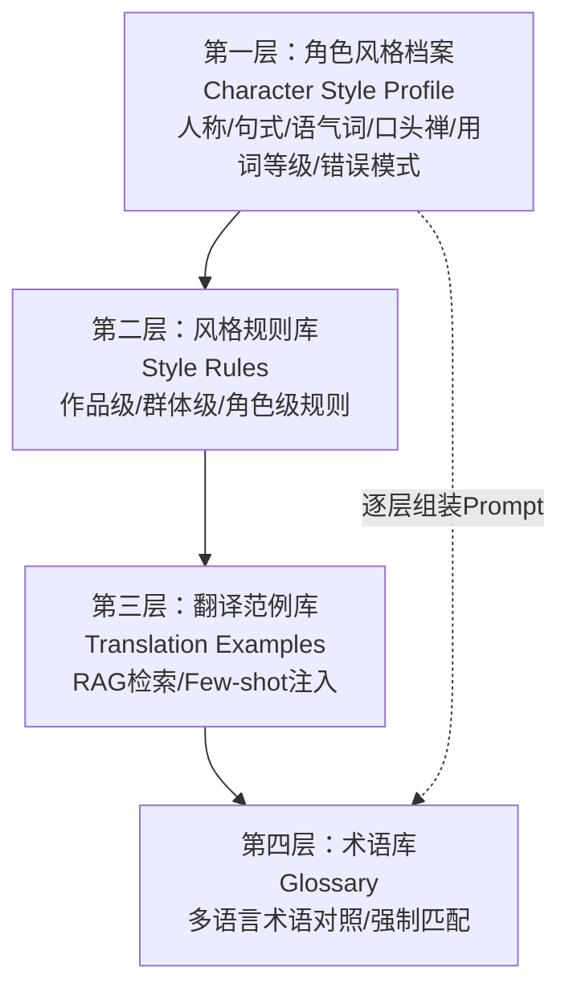
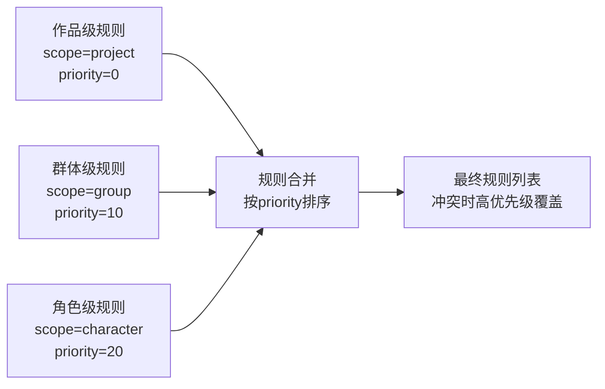
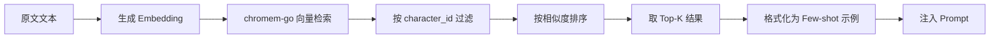
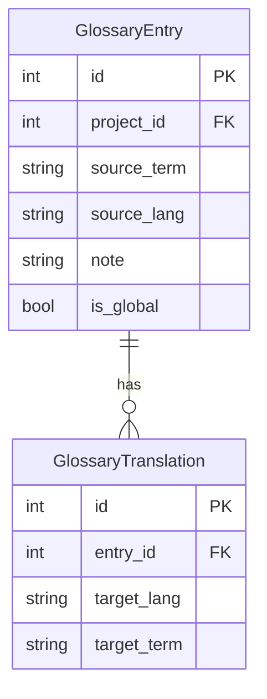
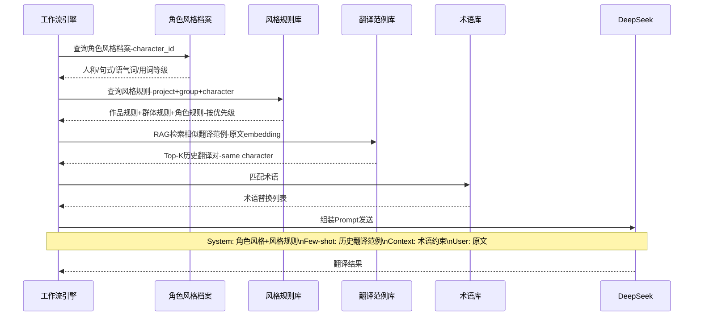
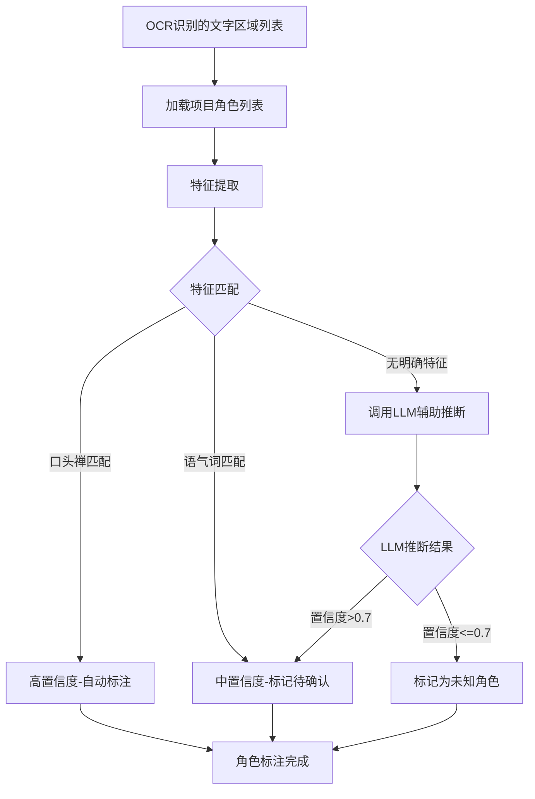

# 知识库系统方案

## 四层结构总览

知识库采用四层结构设计，从角色风格定义到术语约束逐层构建翻译上下文，确保每个角色的翻译风格一致性。翻译时按层组装 Prompt，让 LLM 学习"这个角色以前是怎么说话的"。



| 层级 | 名称 | 数据来源 | Prompt 中的作用 |
|------|------|----------|-----------------|
| L1 | 角色风格档案 | CharacterProfile 表 | System Prompt 中的角色风格描述 |
| L2 | 风格规则库 | StyleRule 表 | System Prompt 中的翻译约束 |
| L3 | 翻译范例库 | TranslationExample 表 + chromem-go | Few-shot 示例注入 |
| L4 | 术语库 | GlossaryEntry + GlossaryTranslation 表 | 术语强制匹配替换 |

## 第一层：角色风格档案

### 数据结构

```go
type CharacterProfile struct {
    ID                int64  `json:"id"`
    ProjectID         int64  `json:"project_id"`
    Name              string `json:"name"`               // 角色名称
    GroupName         string `json:"group_name"`         // 所属群体
    PronounPreference string `json:"pronoun_preference"` // 人称代词偏好
    SentenceStyle     string `json:"sentence_style"`     // 句式特点
    ToneWords         string `json:"tone_words"`         // 语气词
    Catchphrase       string `json:"catchphrase"`        // 口头禅
    VocabLevel        string `json:"vocab_level"`        // 用词等级
    ErrorPattern      string `json:"error_pattern"`      // 错误模式
    Description       string `json:"description"`        // 角色描述
}
```

### 字段说明

| 字段 | 说明 | 示例 |
|------|------|------|
| pronoun_preference | 人称代词偏好 | "俺"/"老子"/"在下"/"本大爷" |
| sentence_style | 句式特点 | 短句祈使句、粗暴直接 / 长句优雅、古风正式 / 中性简洁 |
| tone_words | 语气词，逗号分隔 | "嘿嘿,呐,哼" / "呜呜,呜" |
| catchphrase | 口头禅/标志性台词 | "WAAAGH!" / "我是要成为海贼王的男人！" |
| vocab_level | 用词等级 | coarse（粗俗口语）/ neutral（中性）/ elegant（书面优雅） |
| error_pattern | 错误模式 | 故意用错字模拟粗鲁、省略助词模拟不文雅 |
| group_name | 所属群体 | 兽人(Orc)/海军/贵族 等，用于关联群体级规则 |

### 示例：战锤兽人角色

| 字段 | 示例值 |
|------|--------|
| 角色名 | 哥巴德·铁颚 (Gorbad Ironclaw) |
| 群体 | 兽人 (Orc) |
| 人称代词 | "俺"/"老子" |
| 句式特点 | 短句祈使句、粗暴直接 |
| 语气词/口头禅 | "WAAAGH!"/"哼！" |
| 用词等级 | 粗俗口语 |

### 示例：海贼王角色

| 字段 | 示例值 |
|------|--------|
| 角色名 | 路飞 (Luffy) |
| 群体 | 草帽海贼团 |
| 人称代词 | "俺"/"おれ" |
| 句式特点 | 短句感叹句、热情直率 |
| 语气词/口头禅 | "嘻嘻"/"我是要成为海贼王的男人！" |
| 用词等级 | 中性口语 |
| 错误模式 | 偶尔用错敬语 |

## 第二层：风格规则库

### 三级作用域

| 作用域 | scope 值 | 说明 | 优先级 |
|--------|----------|------|--------|
| 作品级 | project | 整体语言风格、时代背景、读者群定位 | 低 |
| 群体级 | group | 种族/阵营/职业的统一说话风格 | 中 |
| 角色级 | character | 单个角色的特殊规则 | 高 |

**优先级规则**：角色级 > 群体级 > 作品级。高优先级规则覆盖低优先级冲突规则，非冲突规则累加。

### 规则类型

| rule_type | 说明 |
|-----------|------|
| tone | 语气规则，如"全部使用感叹号" |
| vocab | 用词规则，如"禁止使用书面语" |
| format | 格式规则，如"对话用短句，叙述用长句" |
| other | 其他自定义规则 |

### 优先级机制



**合并算法**：
1. 按优先级从低到高加载规则
2. 同一 rule_type 的高优先级规则覆盖低优先级规则
3. 不同 rule_type 的规则累加
4. 最终生成去重后的规则列表

### 示例

| 作用域 | 规则 | 说明 |
|--------|------|------|
| 作品级 | 时代背景为中世纪，翻译时使用半文言风格 | 作品整体风格约束 |
| 群体级（兽人） | 不用书面语、多用感叹号、省略助词 | 兽人种族统一风格 |
| 角色级（哥巴德） | 对上级使用"老子"，对下级使用"俺" | 单个角色特殊规则 |

## 第三层：翻译范例库

### RAG 检索机制

翻译时，使用 RAG（Retrieval-Augmented Generation）检索与当前原文相似的历史翻译对，作为 Few-shot 示例注入 Prompt。



### Embedding 生成

| 步骤 | 说明 |
|------|------|
| 文本预处理 | 去除特殊字符，统一空白符 |
| 调用 Embedding API | 使用 DeepSeek 或其他 Embedding 模型 |
| 向量归一化 | L2 归一化，确保余弦相似度有效 |
| 存储双写 | 同时写入 chromem-go 索引和 SQLite embedding 字段 |

### 检索参数

| 参数 | 默认值 | 说明 |
|------|--------|------|
| top_k | 5 | 返回的最大范例数 |
| similarity_threshold | 0.7 | 最低相似度阈值，低于此值的范例不返回 |
| character_filter | true | 是否按角色过滤，确保范例来自同一角色 |

### Few-shot 注入 Prompt 策略

检索到的翻译范例按以下格式注入 Prompt 的 Few-shot 区域：

```
以下是该角色的历史翻译范例，请参考其说话风格：

例1:
原文：I'll crush ya!
译文：俺要踩扁你！

例2:
原文：Get out of my way!
译文：给老子滚开！

例3:
原文：WAAAGH!
译文：哇嗷！

请按照以上范例的风格翻译以下文本。
```

### 范例增量更新

- 翻译确认后，自动将原文-译文对添加到翻译范例库
- 新增范例时生成 embedding 并索引
- 支持手动删除低质量范例
- 定期清理与当前角色风格偏差过大的范例

## 第四层：术语库

### 多语言结构

术语库采用 `GlossaryEntry` + `GlossaryTranslation` 两表结构，支持一个源术语对应多条目标语言翻译。



**设计优势**：
- 一个源术语可对应多种目标语言翻译（如 "WAAAGH!" → 中文"哇嗷！"、日文"ワアア！"、韩文"와아아！"）
- 新增目标语言只需添加一条 GlossaryTranslation 记录，无需修改表结构
- 源术语信息（备注、作用域）只需维护一份

### 优先级合并

术语库支持全局术语和项目级术语两层，翻译时按优先级合并：

| 层级 | is_global | 优先级 | 说明 |
|------|-----------|--------|------|
| 项目级术语 | false | 高 | 当前项目专属术语，覆盖全局术语冲突 |
| 全局术语 | true | 低 | 跨项目共享的通用术语 |

**合并规则**：
1. 先加载全局术语
2. 再加载项目级术语
3. 同一源术语，项目级翻译覆盖全局翻译
4. 不同源术语累加

### 示例

**全局术语：**

| source_term | source_lang | target_lang | target_term | note |
|-------------|-------------|-------------|-------------|------|
| WAAAGH! | en | zh-CN | 哇嗷！ | 兽人战吼，不可翻译为其他词 |
| WAAAGH! | en | ja | ワアア！ | |
| Orc | en | zh-CN | 兽人 | 种族名 |

**项目级术语（战锤项目）：**

| source_term | source_lang | target_lang | target_term | note |
|-------------|-------------|-------------|-------------|------|
| Empire | en | zh-CN | 帝国 | 专有名词，不译为"帝国"以外的词 |
| Chaos | en | zh-CN | 混沌 | 专有名词 |

## 知识库使用流程

翻译时，工作流引擎按以下流程逐层组装 Prompt 上下文：



### Prompt 组装顺序

1. **System Prompt 开头**：翻译角色定义 + 语言对声明
2. **角色风格描述**：从 CharacterProfile 读取人称代词、句式、语气词等
3. **风格规则约束**：从 StyleRule 按优先级加载，按 rule_type 分组
4. **术语约束**：从 Glossary 匹配结果列出术语-翻译对照表
5. **Few-shot 示例**：从 TranslationExample RAG 检索的 Top-K 结果
6. **翻译任务**：待翻译原文

## 角色自动推断机制设计

### 推断流程



### 推断策略

| 策略 | 实现方式 | 置信度 | 优先级 |
|------|----------|--------|--------|
| 口头禅匹配 | 检查文字是否包含角色 catchphrase | 高（0.9+） | 1 |
| 语气词匹配 | 检查文字中是否包含角色 tone_words | 中（0.6-0.8） | 2 |
| 群体特征匹配 | 检查文字风格是否符合 group_name 的群体规则 | 中（0.5-0.7） | 3 |
| 位置推断 | 根据气泡位置与角色空间关系推断 | 低（0.3-0.5） | 4 |
| LLM 辅助推断 | 调用 LLM 分析对话上下文推断角色 | 依赖 LLM 输出 | 5 |
| RAG 相似度 | 在 character_signatures 集合中检索相似文本 | 中（0.5-0.8） | 6 |

### 推断结果处理

| 置信度范围 | 处理方式 | 用户交互 |
|-----------|----------|----------|
| > 0.8 | 自动标注角色 | 无需用户确认（虚线框标识） |
| 0.5 - 0.8 | 标注但标记为待确认 | 工作流中断，提示用户确认 |
| < 0.5 | 标记为未知角色 | 工作流中断，用户需手动指定角色 |

### 推断反馈学习

用户修正角色标注后：
1. 更新 `text_regions` 表的 `character_id` 和 `character_confidence` 字段
2. 将修正后的文本-角色对添加到 `translation_examples` 表
3. 重新生成 character_signatures 集合的索引
4. 后续推断时利用更新后的数据提升准确性
