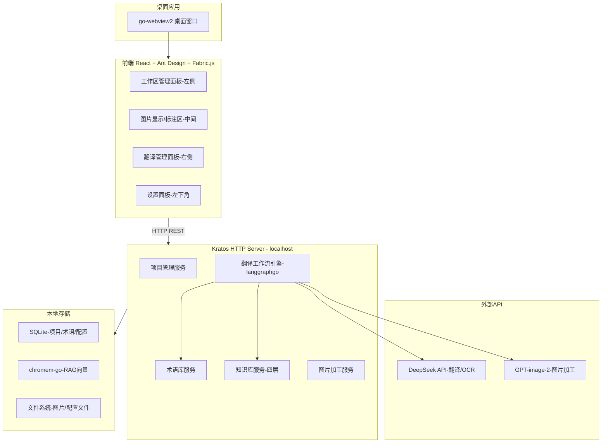
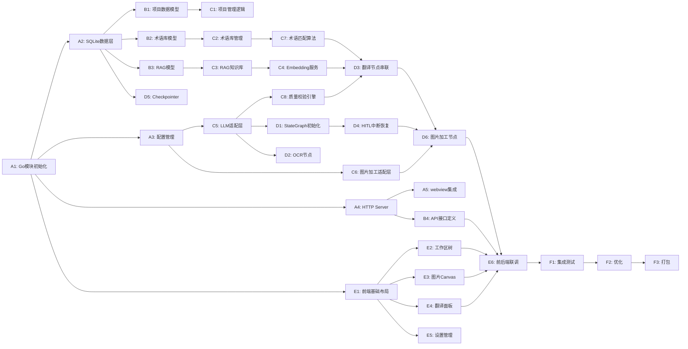

# 漫画翻译工具 - 技术方案总览

## 项目简介

漫画翻译工具是一款面向漫画翻译场景的桌面应用，集成 OCR 识别、LLM 翻译、知识库管理、图片加工等能力，支持角色风格保持、术语一致性、翻译范例学习，提供从识别到成品图片的完整翻译工作流。

## 技术栈总览

| 层级 | 技术 | 说明 |
|------|------|------|
| 桌面壳 | go-webview2 | Go 绑定 WebView2，轻量桌面窗口，无需 Electron |
| 前端框架 | React 18 + TypeScript | 组件化 UI 开发，类型安全 |
| UI 组件库 | Ant Design 5 | 企业级 UI 组件，开箱即用 |
| 图片标注 | Fabric.js | Canvas 图形库，支持文字区域选择/拖拽/缩放 |
| 状态管理 | Zustand | 轻量级状态管理，简洁 API |
| 后端框架 | Kratos v2 | B站开源 Go 微服务框架，HTTP/gRPC 支持 |
| 工作流引擎 | langgraphgo | Go 实现的 LangGraph，支持状态图/HITL/断点恢复 |
| LLM 集成 | langchaingo | Go 版 LangChain，统一 LLM Provider 接口 |
| 数据库 | SQLite (modernc.org/sqlite) | 纯 Go 实现，轻量嵌入式关系库，零部署 |
| 向量存储 | chromem-go | Go 原生向量数据库，嵌入式无外部依赖 |
| LLM 翻译 | DeepSeek API | 高性价比 LLM，支持翻译与 OCR |
| 图片加工 | GPT-image-2 API | OpenAI 图片编辑模型，Inpainting 能力强 |
| 配置格式 | YAML | 工作区配置、应用配置统一使用 YAML |
| 构建工具 | Vite | 前端快速构建与热更新 |
| 包管理 | Go Modules / pnpm | Go 模块管理与 Node.js 包管理 |

## 整体架构图

## 子方案文档索引

| 文档 | 说明 |
|------|------|
| [01-product-interaction.md](./01-product-interaction.md) | 产品交互方案：界面布局、核心交互流程、文本识别模式、术语库交互、角色标注等 |
| [02-frontend-design.md](./02-frontend-design.md) | 前端方案：技术选型、项目结构、组件设计、状态管理、API服务层 |
| [03-backend-design.md](./03-backend-design.md) | 后端方案：Kratos框架、Service/Biz/Data层、HTTP路由、配置管理、打包部署 |
| [04-agent-workflow.md](./04-agent-workflow.md) | Agent模型/工作流方案：StateGraph设计、各节点详细设计、HITL机制、Prompt组装 |
| [05-database-schema.md](./05-database-schema.md) | 数据库结构方案：完整ER图、各表设计、向量存储、Migration策略、索引设计 |
| [06-knowledge-base.md](./06-knowledge-base.md) | 知识库系统方案：四层结构、角色风格档案、风格规则、翻译范例RAG、术语库 |

## 开发计划概览

共 32 个工作项，分为 Phase A-F 六个阶段，预计总工期约 16 个工作日（可并行执行部分任务）。

| 阶段 | 主题 | 工作项数 | 预估工期 | 说明 |
|------|------|----------|----------|------|
| Phase A | 基础设施 | 5 | 3天 | Go模块、SQLite、配置、HTTP Server、webview |
| Phase B | 数据模型 | 4 | 2天 | 项目模型、术语库模型、RAG模型、API接口 |
| Phase C | 核心业务 | 8 | 4天 | 项目管理、术语库、RAG、LLM、质量校验 |
| Phase D | 工作流 | 6 | 5天 | StateGraph、OCR、翻译串联、HITL、图片加工 |
| Phase E | 前端 | 6 | 5天 | 布局、工作区树、Canvas、翻译面板、联调 |
| Phase F | 集成 | 3 | 3天 | 集成测试、优化、打包 |

### 依赖关系图

### 各阶段工作项明细

#### Phase A - 基础设施

| 编号 | 工作项 | 预估工期 | 说明 |
|------|--------|----------|------|
| A1 | Go模块初始化 | 1天 | 项目脚手架、目录结构、go mod init |
| A2 | SQLite数据层 | 1天 | 数据库初始化、ORM映射、迁移脚本 |
| A3 | 配置管理 | 1天 | YAML配置读写、环境变量覆盖 |
| A4 | HTTP Server | 1天 | Kratos HTTP Server启动、路由注册 |
| A5 | webview集成 | 1天 | go-webview2嵌入、前端资源加载 |

#### Phase B - 数据模型

| 编号 | 工作项 | 预估工期 | 说明 |
|------|--------|----------|------|
| B1 | 项目数据模型 | 1天 | Project/Chapter/Image表结构、CRUD |
| B2 | 术语库模型 | 1天 | GlossaryEntry/GlossaryTranslation表、多语言翻译映射 |
| B3 | RAG模型 | 1天 | RAGEntry表、向量存储接口 |
| B4 | API接口定义 | 1天 | Proto/HTTP接口定义、请求响应结构 |

#### Phase C - 核心业务

| 编号 | 工作项 | 预估工期 | 说明 |
|------|--------|----------|------|
| C1 | 项目管理逻辑 | 1天 | 创建/打开/删除项目、目录映射 |
| C2 | 术语库管理 | 1天 | 术语CRUD、多语言翻译管理、全局/项目级逻辑 |
| C3 | RAG知识库 | 1天 | chromem-go集成、向量检索 |
| C4 | Embedding服务 | 1天 | Embedding生成、批量索引 |
| C5 | LLM适配层 | 1天 | DeepSeek API封装、Prompt模板 |
| C6 | 图片加工适配层 | 1天 | GPT-image-2 API封装、Inpainting接口 |
| C7 | 术语匹配算法 | 1天 | 模糊匹配、优先级排序 |
| C8 | 质量校验引擎 | 1天 | 翻译质量评估、重试策略 |

#### Phase D - 工作流

| 编号 | 工作项 | 预估工期 | 说明 |
|------|--------|----------|------|
| D1 | StateGraph初始化 | 1天 | langgraphgo状态图定义、节点注册 |
| D2 | OCR节点 | 1天 | DeepSeek OCR调用、文本区域解析 |
| D3 | 翻译节点串联 | 2天 | 术语匹配→RAG→LLM→校验流水线 |
| D4 | HITL中断恢复 | 1天 | 用户审核中断点、状态恢复续跑 |
| D5 | Checkpointer | 1天 | 工作流状态持久化、SQLite存储 |
| D6 | 图片加工节点 | 2天 | Inpainting+文字渲染+图片合成 |

#### Phase E - 前端

| 编号 | 工作项 | 预估工期 | 说明 |
|------|--------|----------|------|
| E1 | 前端基础布局 | 1天 | 三栏布局、路由、状态管理 |
| E2 | 工作区树 | 1天 | 项目/章节/图片树形结构 |
| E3 | 图片Canvas | 2天 | Fabric.js图片显示、区域标注 |
| E4 | 翻译面板 | 1天 | 原文/译文对照、审核交互 |
| E5 | 设置管理 | 1天 | 术语库设置、API配置、偏好 |
| E6 | 前后端联调 | 2天 | API对接、完整流程联调 |

#### Phase F - 集成

| 编号 | 工作项 | 预估工期 | 说明 |
|------|--------|----------|------|
| F1 | 集成测试 | 1天 | 端到端流程测试、边界场景 |
| F2 | 优化 | 1天 | 性能调优、内存泄漏检测 |
| F3 | 打包 | 1天 | 单文件可执行打包、安装程序 |
